# FastAPI Foundation: How a Request Is Served

> This guide is visual first. Read the diagrams from top to bottom, then use the short explanations and code to connect each box to this repository.

## 1. The one-picture mental model

```mermaid
flowchart LR
    C["Client<br/>Browser / Mobile / curl"]
    U["Uvicorn<br/>HTTP server"]
    M["ASGI middleware<br/>CORS, request ID, logs"]
    R["Starlette router<br/>method + path match"]
    F["FastAPI<br/>dependency injection + validation"]
    H["Path operation<br/>Python function"]
    S["Service<br/>business rules"]
    P["Repository<br/>data access"]
    D[("Database / storage")]

    C -->|"HTTP request"| U
    U -->|"ASGI scope + events"| M
    M --> R
    R --> F
    F -->|"validated Python values"| H
    H --> S
    S --> P
    P --> D

    D --> P
    P --> S
    S --> H
    H -->|"Python object"| F
    F -->|"JSON response"| M
    M --> U
    U -->|"HTTP response"| C
```

The most important separation is:

| Part | Main job |
|---|---|
| **Uvicorn** | Opens the network port, speaks HTTP, and calls the application using ASGI. |
| **Starlette** | Supplies the web foundation: routing, requests, responses, middleware, WebSockets, and lifecycle behavior. |
| **FastAPI** | Uses Python type hints for input extraction, validation, dependency injection, OpenAPI, and response handling. |
| **Pydantic** | Turns untrusted input into validated Python objects and serializes typed output. |
| **Your code** | Implements the application's business rules and data access. |

FastAPI is therefore **not the process listening directly on port 8000**. Uvicorn is the server process. FastAPI is the ASGI application that Uvicorn calls.

---

## 2. Foundation stack

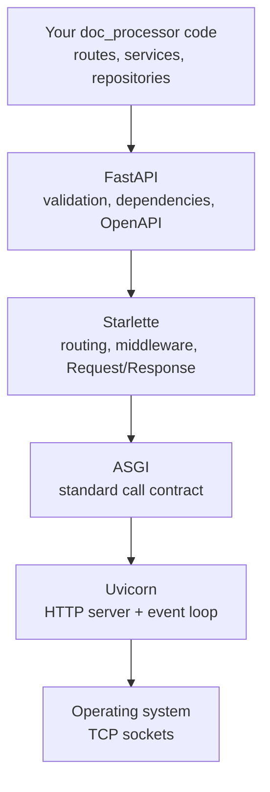

### ASGI in one minute

ASGI is the contract between an async Python server and an async Python application. Conceptually, Uvicorn calls an application like this:

```python
await app(scope, receive, send)
```

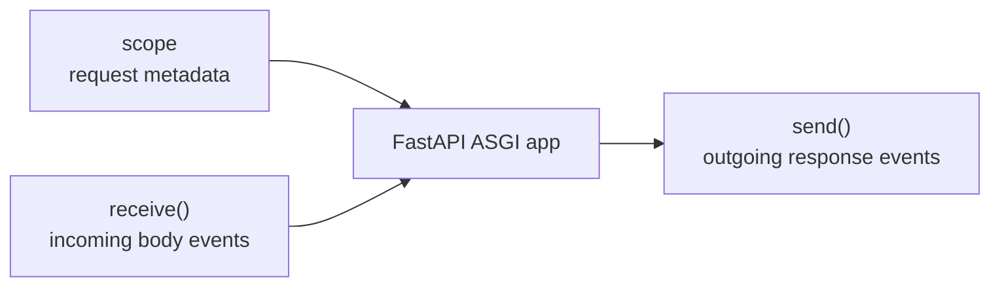

- `scope` contains facts such as `type="http"`, path, method, headers, client address, and server address.
- `receive()` supplies request-body events without forcing the worker to block while bytes arrive.
- `send()` emits the response status, headers, and body.

You normally do not call these objects yourself. FastAPI and Starlette turn them into convenient parameters and response objects.

---

## 3. Your repository today

```text
src/doc_processor/
├── main.py                       # application creation; currently empty
├── api/
│   ├── __init__.py              # package marker; may remain empty
│   ├── router.py                # joins route modules; currently empty
│   └── v1/
│       ├── __init__.py          # package marker; may remain empty
│       └── routes/
│           ├── __init__.py      # package marker; may remain empty
│           └── health.py        # health endpoint; currently empty
├── schemas/                     # API input/output models
├── services/                    # business use cases
├── repositories/                # persistence operations
├── model/                       # database/domain models
├── db/                          # connection/session setup
└── core/                        # settings, logging, middleware, errors
```

An `__init__.py` file tells Python that the directory is an importable package. It does **not** need to contain the router or application. Keeping it empty is normal.

### Recommended responsibility map

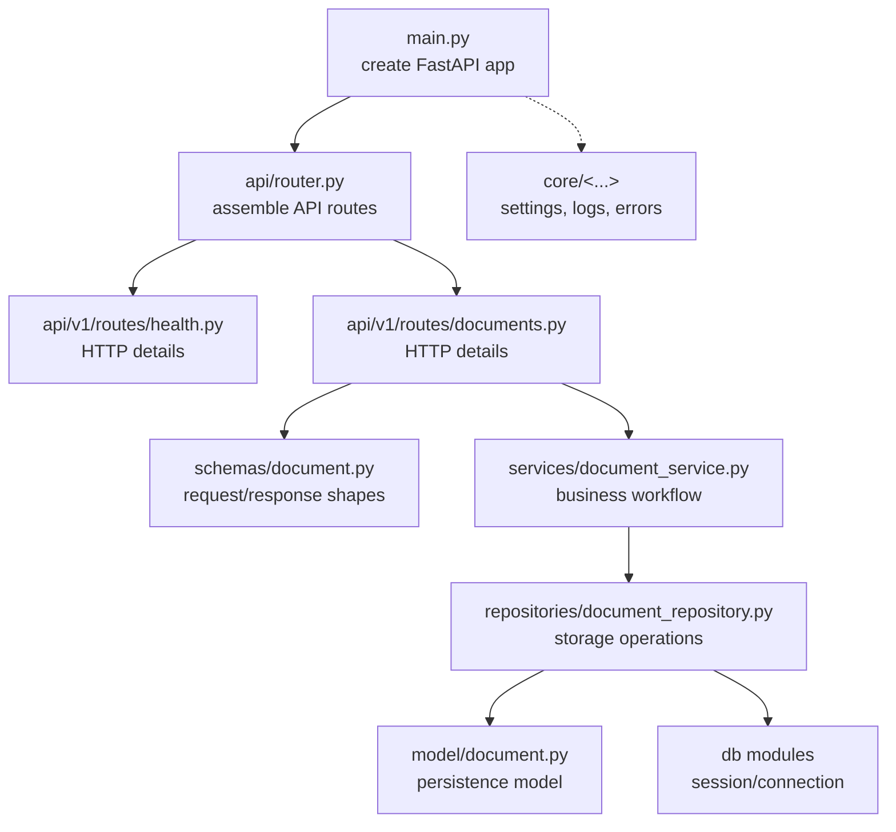

Arrows mean “knows about/calls.” Avoid reversing them: a repository should not import an API route, for example.

---

## 4. Application startup: work done once

Before any request can be served, Python imports the modules and the route decorators register path operations.

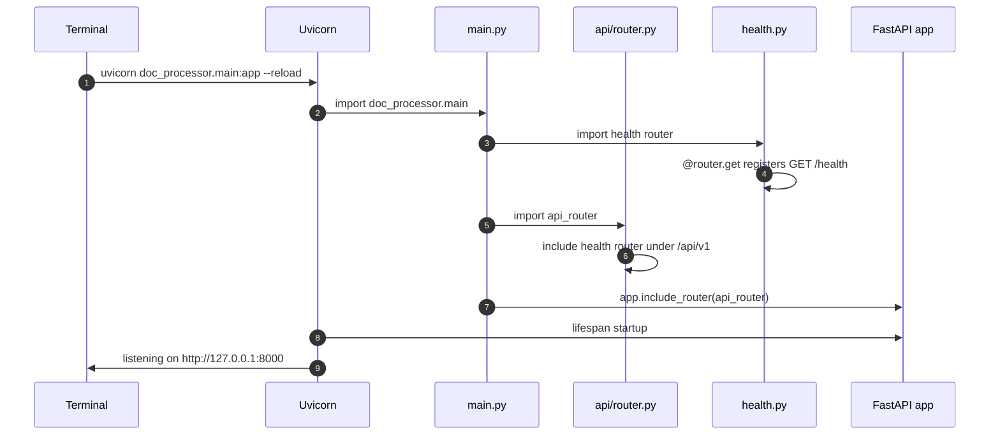

The decorators execute during import:

```python
@router.get("")
async def get_health() -> dict[str, str]:
    return {"status": "healthy"}
```

`@router.get("")` does not run `get_health()`. It records metadata similar to:

```text
HTTP method: GET
local path:  ""
callable:    get_health
output type: dict[str, str]
```

Prefixes then combine:

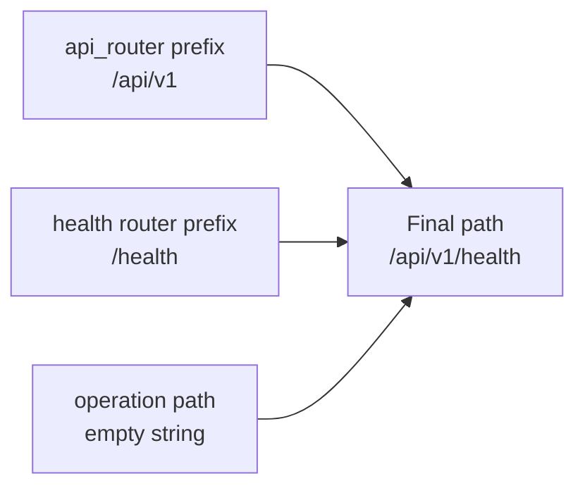

### Minimal wiring matching this repository

`src/doc_processor/main.py`

```python
from fastapi import FastAPI

from doc_processor.api.router import api_router

app = FastAPI(title="Document Processor", version="0.1.0")
app.include_router(api_router)
```

`src/doc_processor/api/router.py`

```python
from fastapi import APIRouter

from doc_processor.api.v1.routes import health

api_router = APIRouter(prefix="/api/v1")
api_router.include_router(health.router)
```

`src/doc_processor/api/v1/routes/health.py`

```python
from fastapi import APIRouter

router = APIRouter(prefix="/health", tags=["health"])


@router.get("")
async def get_health() -> dict[str, str]:
    return {"status": "healthy"}
```

> These snippets describe the intended foundation. At the time this guide was written, those project files were still empty and FastAPI was not yet present in `pyproject.toml`.

---

## 5. Request flow: `GET /api/v1/health`

### Request

```http
GET /api/v1/health HTTP/1.1
Host: 127.0.0.1:8000
Accept: application/json
```

### Flowchart

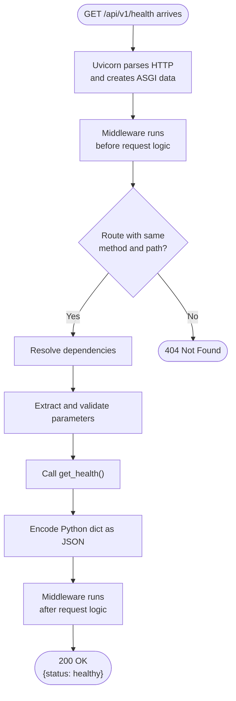

### Sequence diagram

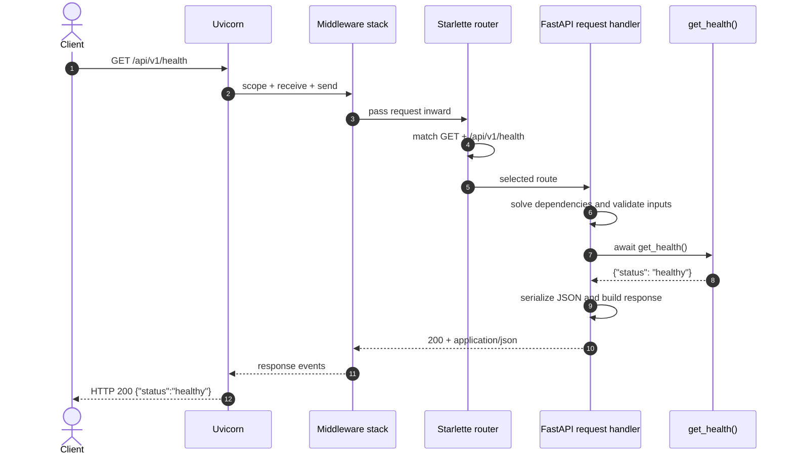

There is no body model, database, or service in this request, so FastAPI can call the route function immediately after routing and dependency resolution.

---

## 6. Real example: submit a document

The following is a target example for the future document-processing feature:

```http
POST /api/v1/documents?extract_text=true HTTP/1.1
Content-Type: application/json
Authorization: Bearer example-token

{
  "name": "invoice.pdf",
  "source_url": "https://files.example.test/invoice.pdf"
}
```

### Where every input comes from

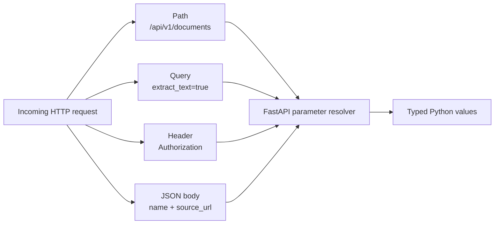

Example route signature:

```python
@router.post("", response_model=DocumentRead, status_code=201)
async def create_document(
    payload: DocumentCreate,
    service: Annotated[DocumentService, Depends(get_document_service)],
    extract_text: bool = True,
) -> DocumentRead:
    return await service.create(payload, extract_text=extract_text)
```

FastAPI interprets this signature:

| Declaration | FastAPI's interpretation |
|---|---|
| `payload: DocumentCreate` | Read JSON body and validate it with Pydantic. |
| `extract_text: bool = True` | Read an optional query parameter and convert it to `bool`. |
| `Depends(get_document_service)` | Execute a dependency and inject its result. |
| `response_model=DocumentRead` | Validate/filter the outgoing value against this public shape. |
| `status_code=201` | Use HTTP `201 Created` after success. |

### Complete success sequence

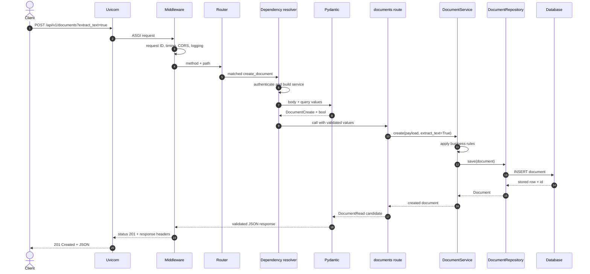

### Layer responsibilities in that sequence

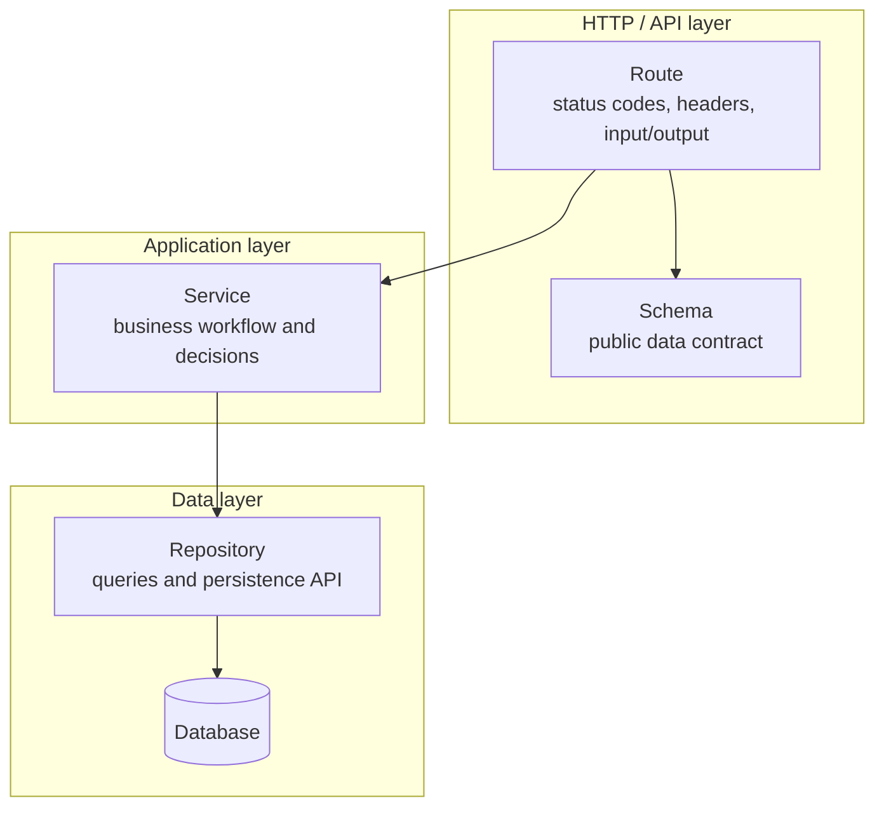

- The **route** knows HTTP, but should contain little business logic.
- The **service** knows the use case, but should not care whether it was called by HTTP, a CLI, or a background worker.
- The **repository** knows storage details, but should not decide business policy.
- The **schema** protects both sides of the API contract.

---

## 7. Validation: the success path and the short-circuit path

Example schemas:

```python
from pydantic import BaseModel, HttpUrl


class DocumentCreate(BaseModel):
    name: str
    source_url: HttpUrl


class DocumentRead(BaseModel):
    id: int
    name: str
    status: str
```

### Decision flow

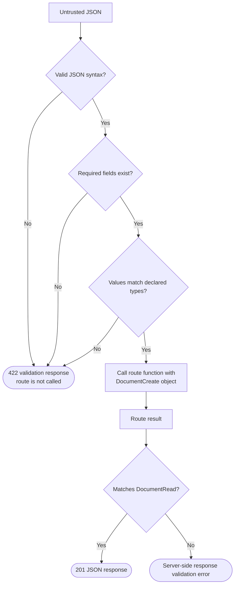

Invalid request:

```json
{
  "name": "invoice.pdf",
  "source_url": "not-a-url"
}
```

FastAPI returns a structured validation error before the service or repository is called. This is a **client input problem**, not a database problem.

### Status-code map

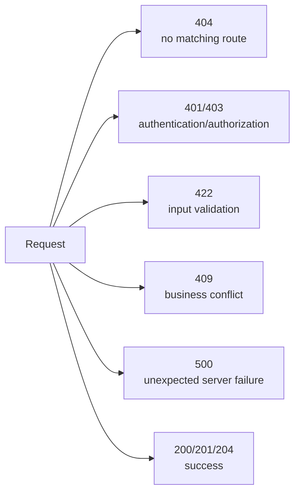

The exact response should be determined by where the request stops:

| Stop point | Typical result |
|---|---|
| No route matches method + path | `404 Not Found` or `405 Method Not Allowed` |
| Authentication dependency rejects credentials | `401 Unauthorized` |
| Authenticated user lacks permission | `403 Forbidden` |
| Request data violates the declared contract | `422 Unprocessable Content` |
| Business state conflicts, such as a duplicate document | `409 Conflict` |
| An unexpected exception escapes | `500 Internal Server Error` |

---

## 8. Dependency injection

`Depends(...)` tells FastAPI how to build a value needed by a route. It is not a global variable and not merely an import.

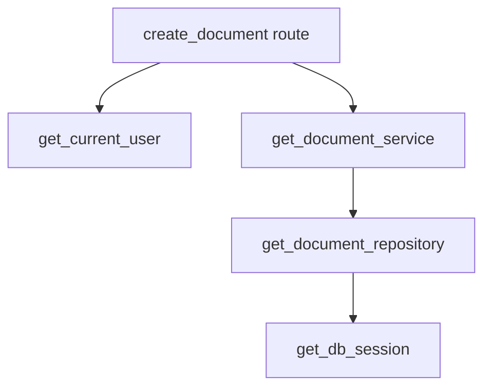

FastAPI treats that as a dependency graph:

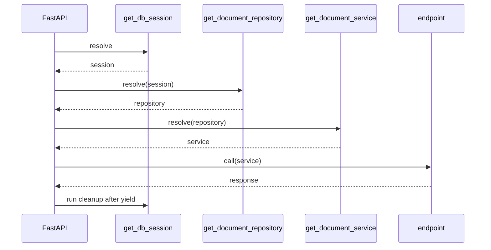

Why this matters:

- Construction is centralized.
- Per-request resources such as database sessions can be cleaned up reliably.
- Authentication can stop the request before business code runs.
- Tests can replace dependencies with fakes.
- Multiple routes can reuse the same dependency graph.

---

## 9. Middleware: the outer wrapper

Middleware surrounds every matching and non-matching request.

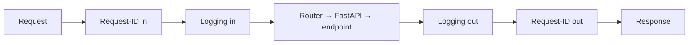

Think of middleware as nested wrappers. The inbound order and outbound order are reversed. Good middleware concerns include:

- Request IDs
- Access logs and duration
- CORS
- Compression
- Trusted hosts
- Error conversion

Business rules such as “only invoice owners may delete invoices” belong in dependencies/services, not generic middleware.

---

## 10. `async def`, `await`, and concurrency

Most API requests spend time waiting for a database, remote API, object store, or incoming/outgoing network data. While one request waits, the event loop can advance another request.

```mermaid
gantt
    title One worker interleaving requests while I/O is pending
    dateFormat X
    axisFormat %L
    section Request A
    Python work      :a1, 0, 2
    Await database   :a2, 2, 6
    Finish response  :a3, 8, 2
    section Request B
    Python work      :b1, 2, 2
    Await storage    :b2, 4, 3
    Finish response  :b3, 7, 1
```

```python
@router.get("/{document_id}")
async def get_document(document_id: int) -> DocumentRead:
    document = await repository.get(document_id)
    return document
```

At `await`, the coroutine can pause without occupying the worker with idle waiting.

### Choose the correct function style

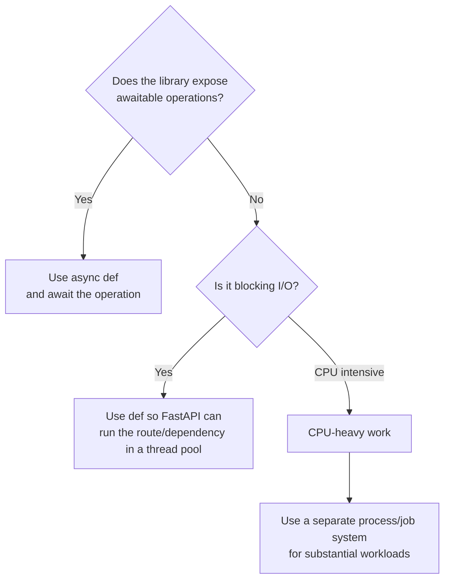

Important rules:

- Use `async def` when calling async libraries with `await`.
- Do not call slow blocking libraries directly inside `async def`; they can freeze that event loop.
- FastAPI runs a path operation or dependency declared with normal `def` in an external thread pool.
- Async concurrency helps I/O-heavy workloads. It does not magically make CPU-heavy OCR or PDF parsing cheap.
- Large OCR, conversion, or embedding jobs are usually better handed to a background job system, with the API returning a job/document ID.

### A document-processing architecture for slow work

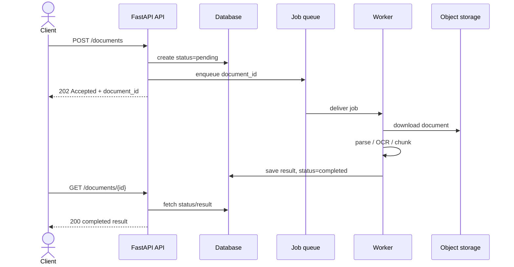

This keeps the request short and prevents long-running document work from tying its lifetime to the client's connection.

---

## 11. How automatic API documentation appears

FastAPI inspects route metadata and Python types to build an OpenAPI document.

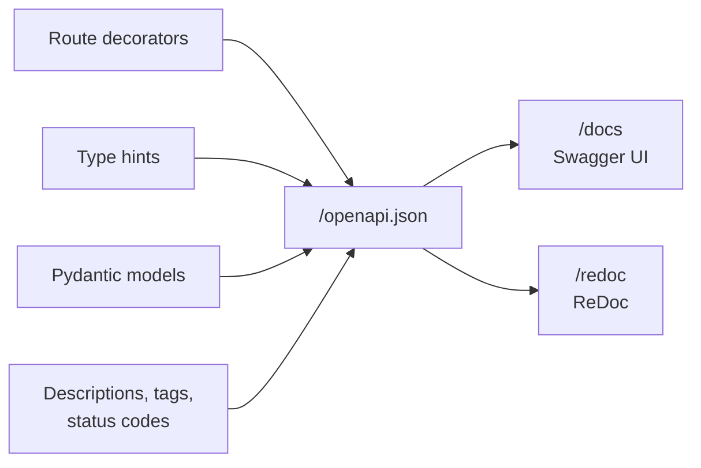

The type hints are doing several jobs at once:

```text
Python type hint
      │
      ├── editor/type-checker help
      ├── runtime request validation
      ├── input conversion
      ├── response filtering/validation
      └── OpenAPI documentation
```

---

## 12. Router matching details

A path is not enough by itself. Routing uses the combination of HTTP method and path.

| Operation | Meaning |
|---|---|
| `GET /documents` | List documents; should not change state. |
| `POST /documents` | Create/submit a document. |
| `GET /documents/42` | Read document 42. |
| `PATCH /documents/42` | Partially update document 42. |
| `DELETE /documents/42` | Delete document 42. |

```mermaid
flowchart TD
    Req["POST /api/v1/documents/42"]
    Prefix{"Prefix matches?"}
    Path{"Path template matches?"}
    Method{"HTTP method allowed?"}
    Endpoint["Selected endpoint"]
    NoRoute["404"]
    WrongMethod["405"]

    Req --> Prefix
    Prefix -->|"No"| NoRoute
    Prefix -->|"Yes"| Path
    Path -->|"No"| NoRoute
    Path -->|"Yes"| Method
    Method -->|"No"| WrongMethod
    Method -->|"Yes"| Endpoint
```

Route order can matter when a fixed path and a parameter path overlap. Register `/documents/me` before `/documents/{document_id}` so that `me` is not interpreted as the ID.

---

## 13. End-to-end trace table

Use this table when debugging a request:

| Step | Component | Question to ask |
|---:|---|---|
| 1 | Client | Was the correct method, URL, headers, and body sent? |
| 2 | Uvicorn | Is the process running and listening on the expected host/port? |
| 3 | Middleware | Did CORS, host checks, or auth-like middleware reject it? |
| 4 | Router | Is the router included, and do all prefixes form the expected path? |
| 5 | Dependencies | Did authentication or resource construction fail? |
| 6 | Pydantic | Does the request satisfy field and type constraints? |
| 7 | Route | Did the correct path operation run? |
| 8 | Service | Which business rule or workflow branch executed? |
| 9 | Repository | Was the intended query/storage operation issued? |
| 10 | Response model | Does returned data satisfy the public response schema? |
| 11 | Middleware | Were response headers and logs added? |
| 12 | Client | What status, headers, and JSON were received? |

---

## 14. Full system architecture for `doc_processor`

```mermaid
flowchart TB
    subgraph Clients["Clients"]
        Web["Web application"]
        CLI["CLI / curl"]
        Other["Other services"]
    end

    subgraph Process["API process"]
        UV["Uvicorn"]
        MW["ASGI middleware"]
        API["FastAPI routers"]
        Validation["Pydantic schemas"]
        Services["Application services"]
        Repositories["Repositories"]
    end

    subgraph Infra["Infrastructure"]
        DB[("PostgreSQL / database")]
        Storage[("Document object storage")]
        Queue["Job queue"]
        Worker["Document worker<br/>parse / OCR / embeddings"]
        External["External APIs/models"]
    end

    Web -->|"HTTPS"| UV
    CLI -->|"HTTPS"| UV
    Other -->|"HTTPS"| UV
    UV --> MW --> API
    API --> Validation
    API --> Services
    Services --> Repositories
    Repositories --> DB
    Services --> Storage
    Services --> Queue
    Queue --> Worker
    Worker --> Storage
    Worker --> DB
    Worker --> External
```

The database, queue, worker, and storage are architectural options for the document-processing direction; they do not exist in the current skeleton yet.

---

## 15. Foundation checklist

```mermaid
flowchart TD
    A["1. Install FastAPI + server"]
    B["2. Create app in main.py"]
    C["3. Create route-level APIRouters"]
    D["4. Assemble them in api/router.py"]
    E["5. Include api_router in app"]
    F["6. Add Pydantic schemas"]
    G["7. Move business logic to services"]
    H["8. Move storage logic to repositories"]
    I["9. Add exception handling and middleware"]
    J["10. Test success and failure paths"]

    A --> B --> C --> D --> E --> F --> G --> H --> I --> J
```

When the foundation is wired, these should become available:

```text
GET  http://127.0.0.1:8000/api/v1/health
GET  http://127.0.0.1:8000/docs
GET  http://127.0.0.1:8000/redoc
GET  http://127.0.0.1:8000/openapi.json
```

## Official references

- [FastAPI overview and framework dependencies](https://fastapi.tiangolo.com/)
- [Bigger applications and `APIRouter`](https://fastapi.tiangolo.com/tutorial/bigger-applications/)
- [Concurrency and `async`/`await`](https://fastapi.tiangolo.com/async/)
- [ASGI middleware](https://fastapi.tiangolo.com/advanced/middleware/)
- [Using the Starlette `Request` directly](https://fastapi.tiangolo.com/advanced/using-request-directly/)
